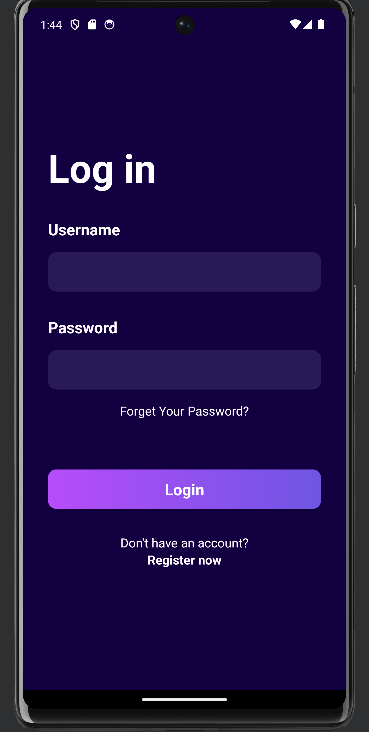
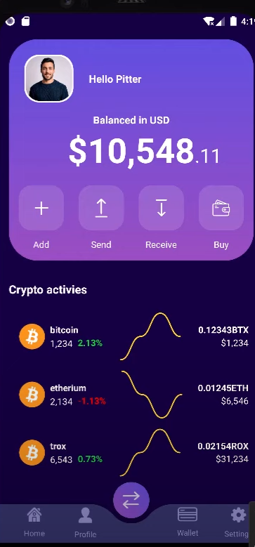

# CryptoApp

Crypto App is a simple Java application for tracking cryptocurrency prices and accessing essential information. This application allows you to monitor cryptocurrency prices in real-time and features a user-friendly interface.

## Features

- Real-time tracking of cryptocurrency prices.
- Create a watchlist for your favorite cryptocurrencies.
- Access detailed information for each cryptocurrency.
- User-friendly and easy-to-use interface.

## Requirements

- Java 8 or a newer version.
- [List your dependencies and libraries]
  

 

 

